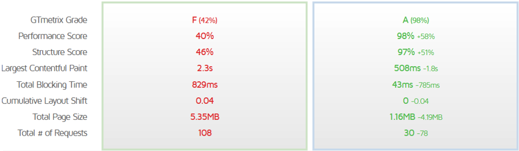

# Euskaltel

The goal of this project is to clone the [Euskaltel's](https://www.euskaltel.com/) original website while improving my Vue.js 3 skills.

## Installation

Clone this repository to your local machine using the following command:

```
git clone https://github.com/ivan-iglesias/euskaltel-clone.git
```

After cloning the repository, navigate to the project directory and install the required dependencies using the following command:

```
npm install
```

To run the project, use the following command:

```
npm run dev
```

This will start a development server and open the project in your default browser.

## Improvement

Comparisons between the original and the improved version:

*GTmetrix*



*Pagespeed Desktop*


*Pagespeed Mobile*


Although we have a great improvement, we have to take into account the lack of third party services which can add to a worsening of performance.
